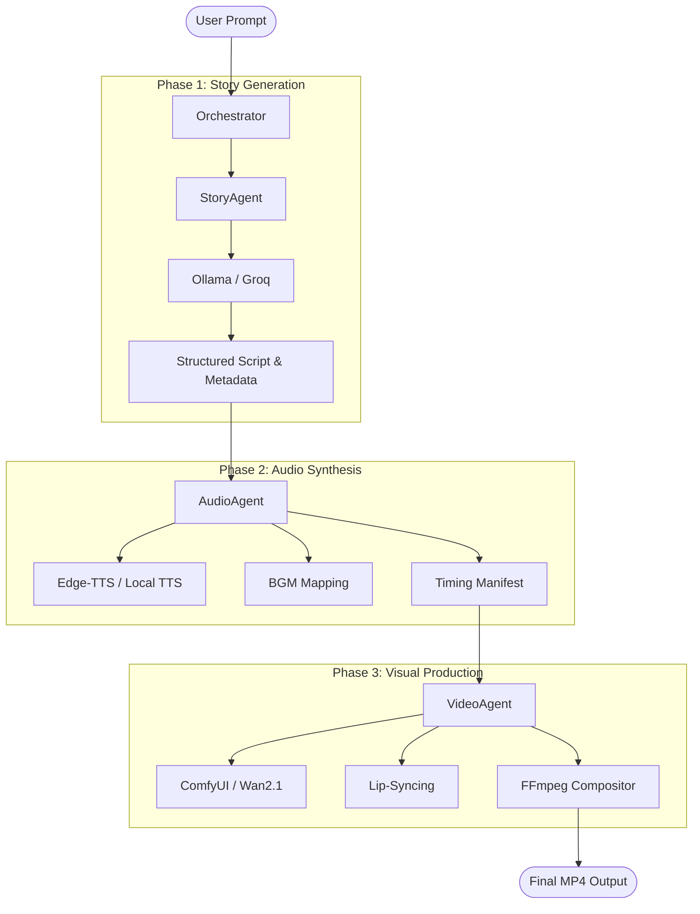

# PixFrameAI: Agentic Video Production Pipeline

This document provides a comprehensive technical overview of the PixFrameAI platform, an agentic AI system designed to transform natural language prompts into fully realized cinematic videos.

## 1. High-Level Architecture

The system is built on a **Modular Agentic Architecture** where specialized agents handle distinct phases of the production lifecycle. These agents communicate via a shared **Project State (DNA)**, ensuring consistency from script to screen.

---

## 2. Phase-by-Phase Technical Details

### Phase 1: The Story Agent (Scripting)
*   **Goal**: Turn a simple idea into a production-ready script.
*   **Process**: 
    *   Uses a system prompt that enforces strict JSON output.
    *   **Character Extraction**: Identifies characters and generates consistent "Visual Descriptions" (e.g., hair color, clothing) used for image generation later.
    *   **Scene Breakdown**: Splits the story into scenes with `visual_description`, `visual_prompt`, and `dialogues`.
*   **Output**: `phase1_state.json` (The "DNA" of the project).

### Phase 2: The Audio Agent (Synthesis & Timing)
*   **Goal**: Create the voiceovers and time the scenes.
*   **Process**:
    *   Iterates through dialogues and generates `.mp3/.wav` files using TTS providers.
    *   **Timing Manifest**: Calculates the exact millisecond start/end times for every line of dialogue. This manifest is the "clock" for the video renderer.
    *   **BGM Selection**: Maps background music to scenes based on the emotional tone detected in the script.
*   **Output**: `timing_manifest.json` and a library of audio assets.

### Phase 3: The Video Agent (Visuals & Composition)
*   **Goal**: Generate high-quality frames and assemble the final video.
*   **Technical Implementation**:
    *   **Image Generation (ComfyUI)**: The agent uses the `image_gen_tool` to interact with ComfyUI's API. It loads a workflow JSON (like Wan2.1 T2I) and dynamically injects the `positive_prompt` and `negative_prompt` into specific node IDs.
    *   **Character Consistency**: The agent prepends the character's visual description to the scene prompt to maintain character looks across different scenes.
    *   **Ken Burns Effect**: Since we generate static frames, FFmpeg is used to apply smooth "Ken Burns" (zoom/pan) animations to make scenes feel alive.
    *   **Wav2Lip**: For scenes with talking characters, the agent triggers a Lip-Sync model to match the character's mouth movements to the generated audio.
    *   **Final Assembly**: FFmpeg merges all scene clips, adds the background music, and burns in subtitles.

---

## 3. MCP (Model Context Protocol) & Tools

The system uses an **MCP-inspired Tooling Layer**. Instead of agents writing raw code to handle complex tasks, they call specialized **Tools**.

### Tool Registry
All tools inherit from a `BaseTool` and are registered in a central registry. This allows the agents to "know" what capabilities they have (e.g., "I can generate an image", "I can edit a video").

*   **`image_gen_tool`**: Interfaces with ComfyUI via HTTP. Handles polling for job completion and downloading results.
*   **`compositor_tool`**: A wrapper around FFmpeg that handles complex filter chains (scaling, padding, Ken Burns, audio mixing).
*   **`wav2lip_tool`**: Manages the local environment requirements for running the Wav2Lip inference.
*   **`subtitle_tool`**: Converts the timing manifest into `.srt` files.

---

## 4. Agentic "Re-runs" & Editing

One of the most powerful features is the **Edit Agent**. 

When a user says *"Make the robot's voice deeper"* or *"Change the background to a forest"*, the system doesn't just re-run everything.
1.  **Intent Analysis**: The Orchestrator determines which phase is affected.
2.  **Partial Execution**: 
    *   If only the voice changes, it re-runs Phase 2 and Phase 3 (re-compositing the video).
    *   If only the visual prompt changes, it re-runs only the image generation for that scene.
3.  **Caching**: The system uses a strict naming convention for assets (e.g., `scene_projectID_sceneID.png`). If an asset exists and hasn't been "dirtied" by an edit, the agent skips generation to save time and GPU resources.
